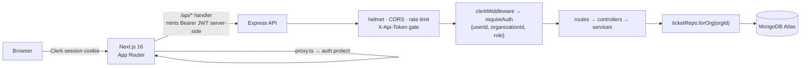

# SupportFlow

**A multi-tenant customer support platform** — ticket triage, ownership, and
escalation for a B2B SaaS support team, built as a production-shaped
application rather than a CRUD demo.

> **Live demo:** <https://supportflow-lake.vercel.app> · **Demo login:** _pending_

---

## What it is

Support agents work two surfaces: an **inbox** for triage and filtering, and a
**ticket workspace** for the conversation, ownership, and SLA state. Tickets
move through a defined lifecycle, can be claimed atomically by one agent, and
escalate into an engineering queue with a tightened SLA.

Every record belongs to an **organization**. A signed-in agent can only ever
see their own workspace's data, and that guarantee is enforced structurally —
see [Tenant isolation](#tenant-isolation-the-part-worth-reading) below.

## Architecture



The browser never holds an API token and never calls the API directly. The
Next.js route handler mints a short-lived Clerk token per request, server-side.

**Why not a `next.config` rewrite?** A rewrite forwards browser cookies, which
works when both services share `localhost` and silently fails in production
where the frontend and API sit on different domains. The explicit handler
behaves identically in both.

## Tech stack

| Layer | |
| --- | --- |
| Frontend | Next.js 16 (App Router), TypeScript, Tailwind CSS, shadcn/ui, TanStack Query |
| API | Node.js, Express 5, Mongoose, Zod |
| Auth & tenancy | Clerk (users, organizations, roles) |
| Database | MongoDB Atlas |
| Tooling | Docker Compose, GitHub Actions, Vitest, node:test + Supertest |

## Tenant isolation, the part worth reading

Three independent layers, so a single mistake is not a data breach:

1. **Single source of truth.** `organizationId` comes from the signed Clerk
   session and nowhere else. A forged `organizationId` in a request body loses
   to the session — there is a test asserting exactly that.
2. **Structural scoping.** `ticketRepo` exposes *only* `forOrg(organizationId)`,
   and calling it without one throws. There is no unscoped query available to
   call by accident, so a future endpoint cannot forget to scope a read.
3. **No existence oracle.** Cross-tenant access returns **404, never 403** — a
   403 would confirm that a ticket id exists in someone else's workspace.

**Verified, not assumed:** the isolation suite is mutation-tested. Deleting the
organization filter from the repository makes 8 of the 10 isolation tests fail.
A suite that still passes against deliberately broken code is worse than no
suite, so this check is part of the definition of done.

## Other things a reviewer might look for

- **Atomic claim.** Taking ownership is one conditional `findOneAndUpdate`, not
  read-then-write, so two agents cannot both believe they claimed a ticket.
- **Faults are classified, not collapsed.** An unreachable database returns
  **503** with a plain explanation; a misconfigured Clerk key returns **503**
  saying so; only genuine application bugs return 500. Debugging a deployment
  should not start with a stack trace.
- **Mass assignment is impossible.** `PATCH` accepts a Zod whitelist
  (`status`, `priority`, `assignedTo`); unknown keys are stripped.
- **Customer messages cannot be forged.** The API accepts only
  `sender: "agent"`. Customer messages will arrive through ingestion channels.
- **Layered by intent.** `routes → controllers → services → repositories`.
  No function mixes HTTP handling, business rules, and database access.

## Running locally

**Prerequisites:** Node.js 20+, a MongoDB connection string, and Clerk API keys
(free tier).

```bash
# 1. API
cd server
cp .env.example .env        # fill in MONGODB_URI + both Clerk keys
npm install
npm run seed                # loads demo tickets
npm run dev                 # :3000
```

```bash
# 2. Frontend, in a second terminal
cd apps/web
cp .env.example .env.local  # fill in Clerk keys + API_URL
npm install
npm run dev                 # :3001
```

Open <http://localhost:3001>. Clerk requires membership of a workspace, so
create one on first sign-in, then seed it with your own organization id:

```bash
npm run seed --prefix server -- --org-id=org_your_id_here
```

**With Docker** (API and MongoDB):

```bash
CLERK_SECRET_KEY=sk_... CLERK_PUBLISHABLE_KEY=pk_... docker compose up --build
```

## Tests

```bash
cd server   && npm test                     # 54 tests
cd apps/web && npm test && npm run typecheck && npm run build
```

The API suite covers the ticket workflow (filtering, claim atomicity,
escalation side effects, validation, mass-assignment protection), tenant
isolation, the shared-secret gate, environment validation, and fault
classification. It runs against an in-memory MongoDB, so it needs no
credentials. CI runs everything on every push and pull request.

## Project structure

```txt
supportflow/
├─ apps/web/              # Next.js frontend
│  └─ src/
│     ├─ app/             # App Router pages + authenticated /api proxy
│     ├─ components/      # UI, ticket inbox and workspace
│     └─ lib/api/         # typed client, Zod response schemas, query hooks
├─ server/                # Express API
│  ├─ api/index.js        # serverless entry (reuses createApp)
│  ├─ models/             # Mongoose schemas
│  ├─ scripts/migrations/ # idempotent, --dry-run capable
│  └─ src/
│     ├─ app.js           # app assembly, no port binding — test friendly
│     ├─ routes/ controllers/ services/ repositories/
│     ├─ validators/      # Zod request schemas
│     ├─ middleware/      # auth, validation, request ids, error handler
│     └─ config/env.js    # validated environment, fails fast at boot
└─ docs/architecture/     # design decisions and their rationale
```

## Dataset

`customer_support/` (gitignored) is the Kaggle
[multilingual customer support tickets](https://www.kaggle.com/datasets/tobiasbueck/multilingual-customer-support-tickets)
dataset by Tobias Bueck — ~136k tickets carrying human `type`, `queue`, and
`priority` labels. Those labels are ground truth for evaluating automated
triage. Raw CSVs are never committed.

## Roadmap

Next, in order:

1. **AI triage and summarization** — a FastAPI service returning schema-validated
   structured output, with every recommendation stored as an auditable decision
   (model, prompt version, confidence, evidence, latency, cost) and applied only
   by a human.
2. **Measured quality** — a TF-IDF baseline the LLM has to beat, scored on the
   same held-out set: per-class precision and recall, calibration, cost per
   1000 tickets, p95 latency.
3. **Semantic retrieval** — embeddings and vector search surfacing similar
   resolved tickets with citations.

Deliberately out of scope: background job queues, workflow automation
builders, and third-party integrations.

## Notes

- The original vanilla HTML/JS frontend (`index.html`, `main.js`, `ticket.js`)
  remains in the repository for reference but is **no longer served** — it has
  no way to hold a Clerk session. The Next.js app is the only interface.
- `npm audit`: clean in `server/` and in the `apps/web` production dependency
  tree. The web dev tree carries advisories reachable only through ESLint's
  `minimatch`, which ship nothing.

## Author

Shruti Chougule — sole author.
