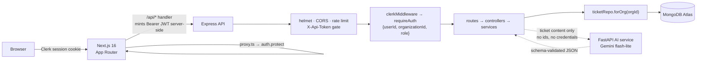

# SupportFlow

**A multi-tenant customer support platform** — ticket triage, ownership, and
escalation for a B2B SaaS support team, built as a production-shaped
application rather than a CRUD demo.

> **Live demo:** <https://supportflow-lake.vercel.app>
>
> **Sign in with** `demo+clerk_test@example.com` / `SupportFlowDemo2026!`
> — a throwaway account on a seeded workspace of 400 tickets. Clerk's sign-in
> card shows a "Development mode" badge; the instance is intentionally a
> development one, since a production instance requires a custom domain.

---

## What it is

Support agents work two surfaces: an **inbox** for triage and filtering, and a
**ticket workspace** for the conversation, ownership, and SLA state. Tickets
move through a defined lifecycle, can be claimed atomically by one agent, and
escalate into an engineering queue with a tightened SLA.

Every record belongs to an **organization**. A signed-in agent can only ever
see their own workspace's data, and that guarantee is enforced structurally —
see [Tenant isolation](#tenant-isolation-the-part-worth-reading) below.

AI suggests a category, priority, and queue for each ticket, with the quotes
behind the suggestion. It never applies anything on its own. Whether that
suggestion is any good is the next section.

## Does the AI actually work?

**Measured, not assumed — and it lost.**

Zero-shot Gemini triage against TF-IDF + logistic regression, both scored on
the same 60 held-out tickets with human labels:

| Target | Always-guess-majority | **TF-IDF baseline** | **LLM (zero-shot)** | Gap |
| --- | --- | --- | --- | --- |
| type | 35.0% | **76.7%** | 58.3% ±12.5 | −18.3 pts |
| queue | 35.0% | **55.0%** | 41.7% ±12.5 | −13.3 pts |
| priority | 41.7% | **63.3%** | 30.0% ±11.6 | −33.3 pts |

Every gap exceeds its 95% interval, so these are real differences rather than
noise. **On priority the LLM scores below the majority-class floor** — always
answering "medium" beats it by twelve points.

### Calibration is the sharper finding

| Stated confidence | Predictions | Mean stated | **Actually right** |
| --- | --- | --- | --- |
| 0.8–1.0 | **55 of 60** | 0.87 | **32.7%** |

92% of answers claimed high confidence while being right about a third of the
time. For a feature whose safety rests on a human reviewing it, confident
wrongness is the worst available failure mode: it suppresses exactly the
checking the design depends on. The grounding step verifies that quoted
evidence really appears in the ticket — it says nothing about whether the
*classification* is right, and this is where that limit shows.

### What follows from it

Not "LLMs cannot triage." Against ~19,000 labelled in-domain examples,
zero-shot prompting loses to a classifier that trains in seconds, answers in
about a millisecond, and costs nothing. Which queue an organization routes
billing questions to is a **learned convention**, and supervision is how
conventions get learned.

The model earns its place elsewhere — summarising a thread, extracting
evidence with citations, handling a category with no training examples yet.
Triage classification is not that, and shipping it as though it were would
have meant shipping a feature that is worse than a constant.

Method: [`notebooks/02-triage-baseline.ipynb`](notebooks/02-triage-baseline.ipynb)
· harness: [`apps/ai-service/app/eval/`](apps/ai-service/app/eval)

<details>
<summary>How the comparison is kept honest</summary>

- **Same rows.** The baseline is re-scored on exactly the tickets the LLM saw.
  An earlier version compared a 60-row LLM run against a 6,530-row baseline;
  the runner now asserts both sides share a majority-class rate and row count,
  because getting this wrong produces a plausible table rather than an error.
- **No leaked subjects.** The train/test split groups by subject —
  [notebook 01](notebooks/01-dataset-exploration.ipynb) found 9,388 repeated
  subjects. A naive random split reports priority accuracy 9.4 points higher
  purely by recognising text it has already seen.
- **Intervals, not point estimates.** At n=60 the margin is ±12 points; any
  gap smaller than its interval is reported as "within noise" rather than as a
  result.
- **Few-shot is supported but unrun.** Worked examples travel in an optional
  request field, drawn strictly from training rows with leakage asserted twice.
  The free tier's daily allowance did not stretch to a second variant.

</details>

## Architecture



The browser never holds an API token and never calls the API directly. The
Next.js route handler mints a short-lived Clerk token per request, server-side.

The dotted path is deliberate: the AI service receives ticket **content** and
returns JSON. It has no database credentials and never sees a ticket id, so it
cannot write anything back — the arrow only goes one way for a reason.

**Why not a `next.config` rewrite?** A rewrite forwards browser cookies, which
works when both services share `localhost` and silently fails in production
where the frontend and API sit on different domains. The explicit handler
behaves identically in both.

## Tech stack

| Layer | |
| --- | --- |
| Frontend | Next.js 16 (App Router), TypeScript, Tailwind CSS, shadcn/ui, TanStack Query, Recharts |
| API | Node.js, Express 5, Mongoose, Zod |
| AI service | Python 3.12, FastAPI, Pydantic, Google Gemini |
| Evaluation | scikit-learn, pandas, Jupyter |
| Auth & tenancy | Clerk (users, organizations, roles) |
| Database | MongoDB Atlas |
| Tooling | Docker Compose, GitHub Actions, Vitest, node:test + Supertest, pytest |

## Tenant isolation, the part worth reading

Three independent layers, so a single mistake is not a data breach:

1. **Single source of truth.** `organizationId` comes from the signed Clerk
   session and nowhere else. A forged `organizationId` in a request body loses
   to the session — there is a test asserting exactly that.
2. **Structural scoping.** `ticketRepo` exposes *only* `forOrg(organizationId)`,
   and calling it without one throws. There is no unscoped query available to
   call by accident, so a future endpoint cannot forget to scope a read.
3. **No existence oracle.** Cross-tenant access returns **404, never 403** — a
   403 would confirm that a ticket id exists in someone else's workspace.

**Verified, not assumed:** the isolation suite is mutation-tested. Deleting the
organization filter from the repository makes 8 of the 10 isolation tests fail.
A suite that still passes against deliberately broken code is worse than no
suite, so this check is part of the definition of done.

## Other things a reviewer might look for

- **Atomic claim.** Taking ownership is one conditional `findOneAndUpdate`, not
  read-then-write, so two agents cannot both believe they claimed a ticket.
- **Faults are classified, not collapsed.** An unreachable database returns
  **503** with a plain explanation; a misconfigured Clerk key returns **503**
  saying so; only genuine application bugs return 500. Debugging a deployment
  should not start with a stack trace.
- **Mass assignment is impossible.** `PATCH` accepts a Zod whitelist
  (`status`, `priority`, `assignedTo`); unknown keys are stripped.
- **Customer messages cannot be forged.** The API accepts only
  `sender: "agent"`. Customer messages will arrive through ingestion channels.
- **Layered by intent.** `routes → controllers → services → repositories`.
  No function mixes HTTP handling, business rules, and database access.

## Running locally

**Prerequisites:** Node.js 20+, a MongoDB connection string, and Clerk API keys
(free tier).

```bash
# 1. API
cd server
cp .env.example .env        # fill in MONGODB_URI + both Clerk keys
npm install
npm run seed                # loads demo tickets
npm run dev                 # :3000
```

```bash
# 2. Frontend, in a second terminal
cd apps/web
cp .env.example .env.local  # fill in Clerk keys + API_URL
npm install
npm run dev                 # :3001
```

```bash
# 3. AI service, optional — the app runs without it
cd apps/ai-service
python3 -m venv .venv && ./.venv/bin/pip install -r requirements.txt
./.venv/bin/uvicorn app.main:app --port 8010   # defaults to the mock provider
```

Set `AI_SERVICE_URL=http://localhost:8010` in `server/.env` to enable the AI
panel. Leaving it unset is supported: the AI endpoints return 503 and the
ticket workspace works normally.

Open <http://localhost:3001>. Clerk requires membership of a workspace, so
create one on first sign-in, then seed it with your own organization id:

```bash
npm run seed --prefix server -- --org-id=org_your_id_here
```

**With Docker** (API and MongoDB):

```bash
CLERK_SECRET_KEY=sk_... CLERK_PUBLISHABLE_KEY=pk_... docker compose up --build
```

## Tests

**181 tests across three suites**, all runnable without credentials or an API
key.

```bash
cd server         && npm test                        # 84
cd apps/web       && npm test                        # 26  (+ typecheck, build)
cd apps/ai-service && ./.venv/bin/python -m pytest -q # 71
```

The API suite covers the ticket workflow (filtering, claim atomicity,
escalation side effects, validation, mass-assignment protection), tenant
isolation, the shared-secret gate, environment validation, and fault
classification, against an in-memory MongoDB. The AI suite covers redaction,
grounding, prompt injection, provider schema translation, and the evaluation
metrics — all against a deterministic mock provider, so CI needs no key,
no network, and costs nothing.

**Isolation is mutation-tested rather than asserted.** Deleting the
organization filter from the ticket repository fails 8 of 10 isolation tests;
from the analytics repository, 5 of 11. A suite that still passes against
deliberately broken code is worse than no suite, so that check is part of the
definition of done.

CI runs all three on every push and pull request.

## Project structure

```txt
supportflow/
├─ apps/
│  ├─ web/                # Next.js frontend
│  │  └─ src/
│  │     ├─ app/          # App Router pages + authenticated /api proxy
│  │     ├─ components/   # inbox, ticket workspace, AI panel, dashboard
│  │     └─ lib/api/      # typed client, Zod response schemas, query hooks
│  └─ ai-service/         # FastAPI — no database credentials by design
│     └─ app/
│        ├─ providers/    # gemini · mock, behind one interface
│        ├─ features/     # summarize · triage, one shared pipeline
│        ├─ eval/         # scoring harness, metrics, comparability guard
│        ├─ redact.py     # secrets stripped before any provider call
│        └─ grounding.py  # quotes verified against their source message
├─ server/                # Express API
│  ├─ api/index.js        # serverless entry (reuses createApp)
│  ├─ models/             # Mongoose schemas, incl. AIDecision
│  ├─ scripts/            # dataset import, AI pre-warm, migrations
│  └─ src/
│     ├─ app.js           # app assembly, no port binding — test friendly
│     ├─ routes/ controllers/ services/ repositories/
│     ├─ validators/      # Zod request schemas
│     ├─ middleware/      # auth, validation, request ids, error handler
│     └─ config/env.js    # validated environment, fails fast at boot
├─ notebooks/             # dataset exploration · TF-IDF baseline
└─ docs/architecture/     # design decisions and their rationale
```

## Dataset

`customer_support/` (gitignored) is the Kaggle
[multilingual customer support tickets](https://www.kaggle.com/datasets/tobiasbueck/multilingual-customer-support-tickets)
dataset by Tobias Bueck. **67,890 tickets** across five files, of which 52,587
carry all three human labels (`type`, `queue`, `priority`) and 29,652 of those
are English. Those labels are the ground truth for evaluating automated triage.
Raw CSVs are never committed.

(Counting lines gives ~136k; ticket bodies contain newlines inside quoted
fields, so `wc -l` overstates the corpus by roughly 2×. See
[`notebooks/01-dataset-exploration.ipynb`](notebooks/01-dataset-exploration.ipynb).)

**What is real and what is simulated.** The subjects, bodies, agent replies,
and all three labels are the dataset's. The corpus carries no identities,
timestamps, or workflow state, so customers, arrival times, and ticket status
are generated by `server/scripts/import-dataset.js`.

That generation is deliberately *internally consistent* rather than random,
because the analytics compute resolution time, SLA compliance, and backlog age
from it: handling time scales with priority, older tickets are more likely
resolved, escalation concentrates in high priority, and a backlogged share is
never worked. An earlier version drew status independently of age and closed
every ticket exactly 45 minutes after it opened — the charts still rendered,
and meant nothing. The modelled workspace is a desk running a triage backlog:
79% of completed work lands inside SLA, and most of what breaches is sitting
untriaged.

## The AI service

A separate FastAPI service (`apps/ai-service`) holding **no database
credentials and no ticket ids**. Express authorises the request, assembles the
content, calls it, and stores the result. The AI therefore cannot modify a
ticket or reach another tenant's data — not because the code declines to, but
because it has no way to. That holds even if the service is compromised or
successfully prompt-injected.

Ticket text is treated as hostile, defended in three layers of decreasing
weight:

1. **The output schema is the ceiling.** A ticket saying *"ignore your
   instructions"* still has to produce a valid `TriageOutput` — there is no
   channel to return prose or call a tool.
2. **Grounding.** Every quote is verified against the message it cites;
   unverifiable ones are dropped and drop the confidence with them.
3. **Prompt delimiting** — useful, and the weakest of the three, which is why
   it is not relied on alone.

Every recommendation is stored as an `AIDecision`: resolved model version,
prompt version, grounding-adjusted confidence, evidence, tokens, latency, and
what the human did about it. An `inputHash` means an unchanged ticket reuses
its answer rather than paying twice.

**Nothing is applied automatically.** Triage returns a suggestion; *Apply*
performs the ordinary authorised PATCH a human would make by hand.

## Roadmap

**Semantic retrieval** — embeddings and vector search surfacing similar
resolved tickets with citations — is designed and deliberately not built. The
evaluation above was the better use of the remaining time: RAG is common in
portfolio projects, measured AI quality is not.

Also out of scope on purpose: background job queues, workflow automation
builders, and third-party integrations.

## Notes

- **Hosting is free.** Three Vercel Hobby projects — frontend, Express API, and
  the Python AI service — plus MongoDB Atlas M0 and Clerk's free tier. Railway,
  the original choice, no longer has one; Render's free tier sleeps for 30–50
  seconds, which reads as a broken link.
- **The AI runs on Gemini's free tier**, which is rate limited. Decisions are
  cached by `inputHash`, and the demo workspace is pre-warmed
  (`npm run prewarm:ai`), so opening a seeded ticket shows its analysis
  instantly without a model call.
- **Clerk is a development instance**, so the sign-in card shows a
  "Development mode" badge. A production instance requires a custom domain,
  which a `*.vercel.app` deployment does not have.
- The original vanilla HTML/JS frontend (`index.html`, `main.js`, `ticket.js`)
  remains in the repository for reference but is **no longer served** — it has
  no way to hold a Clerk session. The Next.js app is the only interface.
- `npm audit`: clean in `server/` and across the `apps/web` tree.

## Author

Shruti Chougule — sole author.
