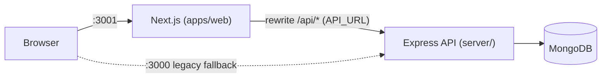

# Phase 2 — Next.js Frontend (parity migration)

Status: **complete** (2026-07-15). The modern frontend lives in `apps/web`
(Next 16 App Router, TypeScript, Tailwind 4, shadcn/ui, TanStack Query, Zod).
The legacy static frontend remains served by the Express app until the
migration fully retires it.

## Topology

- The browser only talks to the Next app; `/api/*` is proxied server-side via
  `next.config.ts` rewrites. **No CORS anywhere.**
- `API_URL` (server-side env, default `http://localhost:3000`) points the
  proxy at the Express API per environment.

## Feature parity map

| Legacy (Express-served)            | Next.js replacement                  | Status |
| ---------------------------------- | ------------------------------------ | ------ |
| `index.html` ticket queue          | `/inbox`                             | ✅ parity + keyboard nav (j/k/Enter, /), URL-synced debounced search, real computed metrics (legacy showed hardcoded 1.4h / 98%) |
| `?view=assigned` / `escalations`   | `/inbox?view=…`                      | ✅ same URL contract |
| Status filter buttons              | `/inbox?status=…`                    | ✅ |
| `ticket.html` detail               | `/tickets/[ticketId]`                | ✅ conversation, claim (409 toast), status select (escalation side-effect toast), reply + internal note (⌘⏎), customer/attributes panels, live SLA countdown |
| `dashboard.html`                   | `/dashboard` placeholder             | ⏳ analytics arrive in a later phase |
| `settings.html`                    | `/settings` placeholder              | ⏳ real settings arrive with Phase 3 auth |
| Light/dark toggle (localStorage)   | next-themes (class strategy, system) | ✅ |

## Conventions established

- **Typed API boundary**: every response is validated with Zod at the fetch
  edge (`src/lib/api/schemas.ts`); contract drift throws instead of rendering
  undefined. These schemas migrate to a shared package when the monorepo lands.
- **Errors**: `ApiError` carries HTTP status; UI branches on 404/409.
- **Data fetching**: TanStack Query; mutations write the returned ticket into
  the detail cache and invalidate list queries.
- **States**: every data surface has skeleton, empty, and error-with-retry
  states.
- **Design system**: shadcn/ui primitives in `src/components/ui`; domain
  components (`StatusBadge`, `PriorityBadge`) map ticket enums to AA-contrast
  colors in both themes.

## Testing

- `npm test` (apps/web): Vitest + jsdom — API client contract tests (query
  building, ApiError mapping, Zod drift rejection) and SLA formatting.
- CI runs lint, typecheck, unit tests, and build for `apps/web`, plus the
  28-test Express suite for `server/`.

## Deferred (intentional)

- SSR initial data / Server Component data fetching (client Query + skeletons
  chosen for the interactive inbox; revisit with Phase 3 session-aware pages).
- React Hook Form (no complex forms yet — arrives with knowledge editor).
- Playwright end-to-end suite (Phase 10 hardening).
- Retiring the legacy frontend (after dashboard/settings/reports parity).
