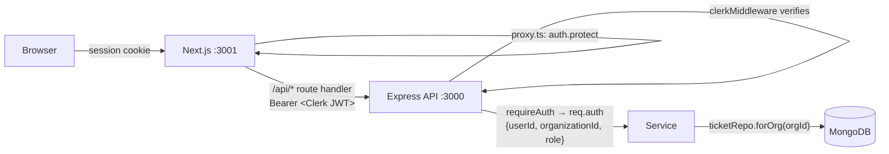

# Phase 3 — Authentication & Multi-Tenancy

Status: **complete** (2026-07-25). Every ticket now belongs to an organization,
and no request reaches data without a verified session.

## Request path

The browser never holds an API token and never calls the API directly. The
Next.js route handler mints a short-lived Clerk token server-side per request.

**Why not a `next.config` rewrite?** A rewrite forwards browser cookies, which
happens to work when both services share `localhost` and silently fails in
production, where Vercel and Railway are different domains. The explicit
handler behaves identically in both.

## The isolation guarantee

Three independent layers, so a single mistake is not a breach:

1. **Source of truth.** `organizationId` comes from the signed Clerk session
   only. Body fields, query parameters, and headers are ignored — there is a
   test asserting a forged `organizationId` in a request body loses to the
   session.
2. **Structural scoping.** `ticketRepo` exposes *only* `forOrg(organizationId)`.
   Every filter it builds starts from that id, and calling it without one
   throws. A future endpoint cannot forget to scope a read; there is no
   unscoped query to call by accident.
3. **No existence oracle.** Cross-tenant access returns **404, never 403**. A
   403 would confirm that a ticket id exists in some other workspace.

### Verified, not assumed

The isolation suite is mutation-tested: deleting the organization filter from
the repository makes **8 of the 10 isolation tests fail**. A test suite that
still passes against broken code is worse than no suite, so this check is part
of the phase's definition of done.

## Roles

| SupportFlow | Clerk key | Can |
| --- | --- | --- |
| Administrator | `org:admin` | Everything a manager can, plus workspace administration |
| Manager | `org:manager` | Reassign tickets to other people or queues |
| Agent | `org:member` | Read, claim, reply, change status |

Authorization is checked against the role on the verified session.
**Unknown Clerk roles degrade to Agent**, the least privileged option, so
adding a role in the Clerk dashboard can never accidentally grant access.

The tenant boundary outranks roles: an administrator of one organization has
no access whatsoever to another's data.

## Data model

- `Organization` — mirrors a Clerk org; holds app settings Clerk knows nothing
  about. `clerkOrgId` is the tenancy key on every record.
- `User` — mirrors a Clerk user for display and "assigned to me" filtering
  without a Clerk API call per ticket. Not org-scoped: one human belongs to
  many organizations. **Never used for authentication or authorization.**
- `Ticket` — gains `organizationId` and `assignedToUserId`.

Membership and role are deliberately **not** duplicated locally. Clerk owns
them; mirroring would create a second source of truth that silently drifts.

### Ticket ids are per-tenant

`ticketId` was globally unique, which would have meant only one customer in the
entire system could ever have an `SF-1001`. It is now unique per organization
via a compound index. Migration `001` performs the swap; it is idempotent and
supports `--dry-run`.

## API changes

| Change | Reason |
| --- | --- |
| `POST /api/tickets/:id/claim` | Replaces the `PATCH assignedTo="You"` idiom. "You" was a placeholder for a real identity; claims now record the actual user id and stay atomic. |
| `PATCH assignedTo` requires manager | Reassigning another person's work is a supervisory action. |
| `?view=assigned` filters by user id | Display names are ambiguous within a workspace; ids are not. |
| `GET /healthz` added | Unauthenticated liveness probe for deployment platforms. |

## The legacy frontend is retired

Express no longer serves the static HTML frontend. It has no way to hold a
Clerk session, so it would have rendered a broken UI against an API that
returns 401. The files remain in the repository for reference; the Next.js app
is the supported interface, and Express is now purely an API.

## Known gaps (carried forward)

- **Local `User` records are not yet populated.** The mirror model exists but
  nothing writes to it; assignee display currently uses the name on the
  session. Populating it belongs with the first feature that needs to list
  workspace members.
- **New workspaces start empty.** There is no self-service demo-data
  provisioning; the inbox says so plainly and shows the seed command rather
  than pretending a filter is at fault.
- **Atlas user is over-privileged** (`atlasAdmin`). Production should use a
  user scoped to `readWrite` on the `supportflow` database (Phase 10).
